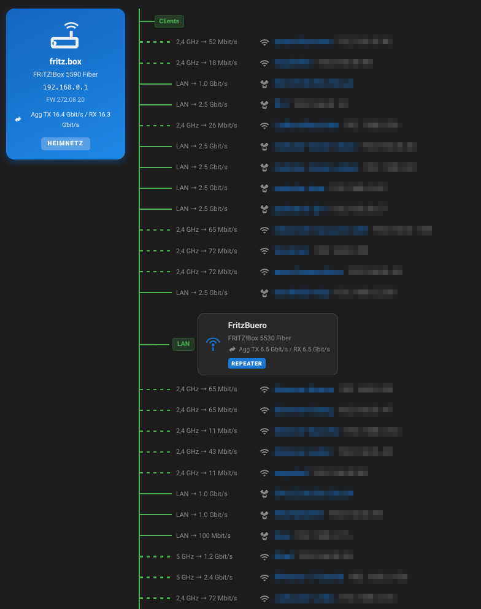

# FRITZ!Box Mesh — Home Assistant Custom Component

Shows which devices are connected to which mesh node (FRITZ!Box master or repeaters/slaves) in your AVM FRITZ!Box mesh network.



:exclamation: **This is an unofficial component that is not officially supported by FRITZ!/AVM**

Disclaimer: No Affiliation with AVM Fritz!
This project is an independent, open-source software developed by David Werth. 
It is not affiliated with, endorsed by, sponsored by, or otherwise connected to AVM GmbH (the makers of FRITZ! products) in any way. 
I have no business relationship with AVM, and this software is provided for informational purposes only.

## Features

- **Native HA entities** — sensors and binary sensors appear directly in HA, no YAML, no MQTT
- **Per mesh node** — Connected Devices, WiFi Devices, LAN Devices count sensors
- **Per client device** — connectivity binary sensor, Mesh Node sensor, Connection type sensor
- **Dynamic discovery** — new devices appearing on the network are added without restarting HA
- **Config flow UI** — set up via Settings → Integrations, no files to edit
- **Auto-refresh** — polls the FRITZ!Box every N seconds (configurable, default 60 s)

## Prerequisites

- Home Assistant 2023.6 or newer
- AVM FRITZ!Box with mesh enabled (FRITZ!OS 7.0+)
- A FRITZ!Box user account with **Smart Home** or admin permissions
  - FRITZ!Box UI → **System → FRITZ!Box Users** → create / select a user → enable access rights

## Installation

### Via HACS (recommended)

1. Open HACS → **Integrations** → ⋮ → **Custom repositories**
2. Add `https://github.com/werthdavid/homeassistant-FRITZmesh` as type **Integration**
3. Install **FRITZ! Mesh**
4. Restart Home Assistant

### Manual

1. Copy `custom_components/FRITZmesh/` into your HA `config/custom_components/` directory:
   ```
   config/
   └── custom_components/
       └── FRITZmesh/       ← copy this whole folder
   ```
2. Restart Home Assistant

## Setup

1. **Settings → Integrations → Add integration → search "FRITZ Mesh"**
2. Fill in the form:

   | Field | Default | Description |
   |---|---|---|
   | Host | `192.168.178.1` | IP or hostname of your FRITZ!Box |
   | Port | `49000` | TR-064 port (`49000` HTTP, `49443` HTTPS) |
   | Username | _(empty)_ | FRITZ!Box username |
   | Password | _(empty)_ | FRITZ!Box password |
   | Use TLS | off | Enable for HTTPS (set port to 49443) |
   | Poll interval | `60` | Seconds between topology refreshes |

3. Click **Submit** — HA validates the credentials and creates the integration

## Using the card

- Find the ID of the topology entity of the mesh master (e.g. `sensor.fritz_box_mesh_192_168_178_1_topology`)
- Create a card in the **Lovelace UI** with the following YAML:
```yaml
type: custom:fritzmesh-card
entity: sensor.fritz_box_mesh_192_168_178_1_topology
```


## Entities created

**Per mesh node** (device = the FRITZ!Box / repeater):

| Entity | Type | Example value |
|---|---|---|
| `{node} Connected Devices` | sensor | `5` |
| `{node} WiFi Devices` | sensor | `3` |
| `{node} LAN Devices` | sensor | `2` |

**Per client device** (device = laptop, phone, etc., identified by MAC):

| Entity | Type | Example value |
|---|---|---|
| `{client}` (connectivity) | binary_sensor | `on` / `off` |
| `{client} Mesh Node` | sensor | `"FRITZ!Box 7590"` |
| `{client} Connection` | sensor | `"WiFi"` / `"LAN"` |

## Troubleshooting

**"Cannot connect" during setup:**
- Verify the FRITZ!Box IP, port (49000 for HTTP, 49443 for HTTPS), and TLS setting
- Ensure the FRITZ!Box user has Smart Home or admin access rights

**"Invalid auth" during setup:**
- Double-check username and password in FRITZ!Box UI → System → FRITZ!Box Users

**Devices show generic names (e.g. long UIDs):**
- Assign friendly names in the FRITZ!Box UI → **Home Network → Network → Devices & Accounts**

**Repeaters not appearing:**
- Ensure devices are configured as a FRITZ!Box mesh (not just WiFi extenders)
  — FRITZ!Box UI → **Home Network → Mesh**

---

## How It Works

Uses the [FRITZconnection](https://github.com/kbr/FRITZconnection) Python library:

1. TR-064 SOAP call to `Hosts1.X_AVM-DE_GetMeshListPath` → gets the mesh list URL
2. Fetches the mesh JSON from the FRITZ!Box (authenticated)
3. Parses `nodes[] → node_interfaces[] → node_links[]` to build the topology tree
4. Cross-references with `FRITZHosts.get_hosts_info()` to add IP addresses and hostnames

